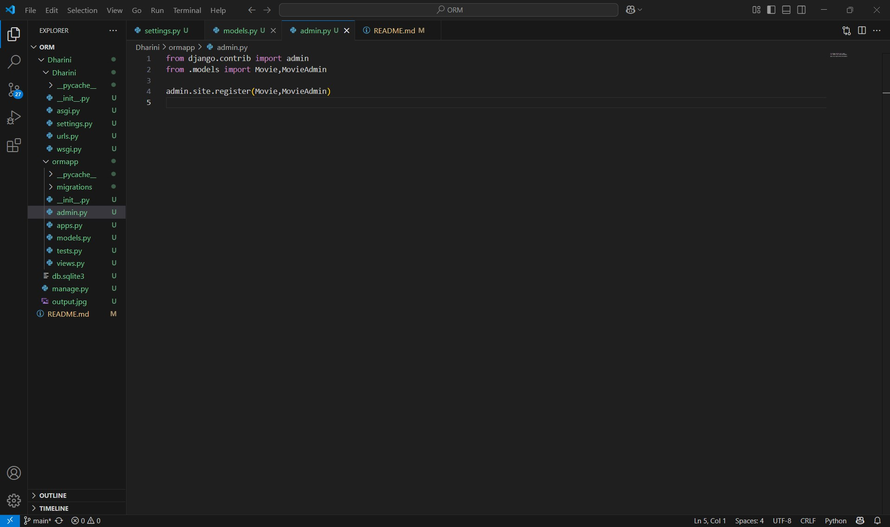
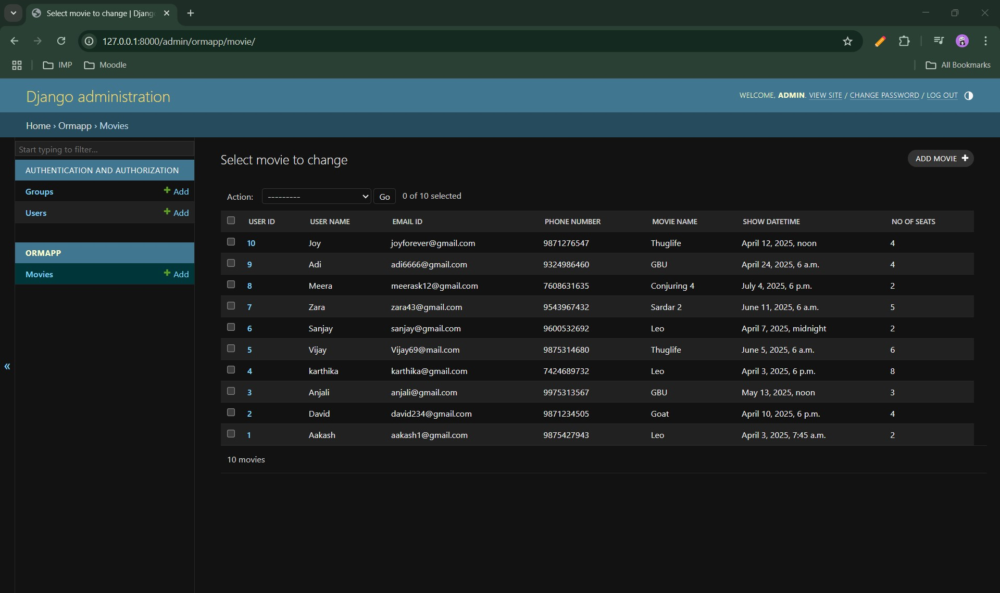

# Ex02 Django ORM Web Application
## Date:03.04.2025

## AIM
To develop a Django application to store and retrieve data from Movies Database using Object Relational Mapping(ORM).

## ENTITY RELATIONSHIP DIAGRAM


## DESIGN STEPS

### STEP 1:
Clone the problem from GitHub

### STEP 2:
Create a new app in Django project

### STEP 3:
Enter the code for admin.py and models.py

### STEP 4:
Execute Django admin and create details for 10 books

## PROGRAM

```
admin.py
from django.contrib import admin
from .models import Movie,MovieAdmin

admin.site.register(Movie,MovieAdmin)

models.py
from django.db import models
from django.contrib import admin

class Movie(models.Model):
    user_id = models.CharField(max_length=20, help_text="User ID")
    user_name = models.CharField(max_length=100)
    email_id = models.EmailField()
    phone_number = models.CharField(max_length=15)
    movie_name = models.CharField(max_length=200)
    show_datetime = models.DateTimeField()
    no_of_seats = models.IntegerField()

class MovieAdmin(admin.ModelAdmin):
    list_display = ('user_id', 'user_name', 'email_id', 'phone_number', 'movie_name', 'show_datetime', 'no_of_seats')

```

## OUTPUT



## RESULT
Thus the program for creating a database using ORM hass been executed successfully
